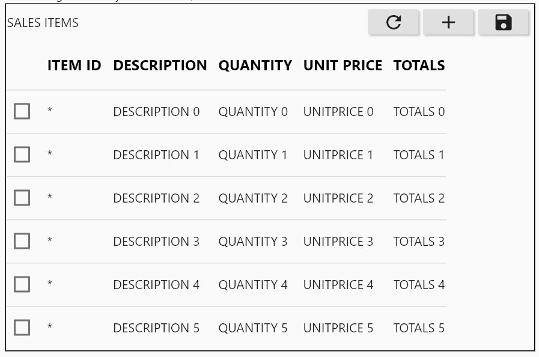
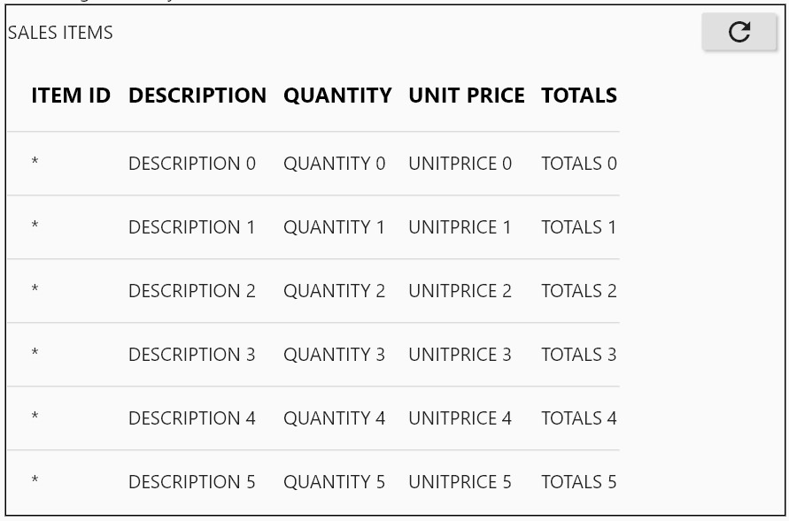

# The EDITPLUSDATATABLE

## BACKGROUND
This is an extension of the  Material library based [Datatable](https://api.flutter.dev/flutter/material/DataTable-class.html) with editing convenience. 
It is coupled with a BLOC that handles data storage and communication with container widgets and applications. Through connection to a REST data source 
or another data source e.g. Google Firestore or the file system, data displayed on the table can be updated and at the same time new data entered into 
the table through its editing interface can be saved.

The EditPlusDataTable is a composite of a title (a text widget), a collection of editing buttons, a collection of input fields (only material TextFormField as at version 0.0.6) and a Material DataTable. 

## SAMPLE EDITABLE TABLE


```dart
EditPlusDataTable(columnNames: tableColumnNames, tableLabel : Text("SALES ITEMS"), tableEditable : true, refreshTableFunction: refreshTableFromREST)
```

## SAMPLE READ ONLY TABLE


```dart
EditPlusDataTable(columnNames: tableColumnNames, tableLabel : Text("SALES ITEMS"), tableEditable : false, refreshTableFunction: refreshTableFromREST)


## RELATIONSHIP WITH BLOC

## SAVING DATA TO BLOC AND BEYOND

## REFRESHING DATA THROUGH END USER REFRESH FUNCTION

## CODE FORMAT
The constructor is of the format below

```dart
  EditPlusDataTable(
    {@required Text tableLabel,                // table label
     @required List<String> columnNames,       // column names for the table, required by Material DataTable
     @required bool tableEditable,             // determine if this is a read only table or table with ability to add items
     @required Function refreshTableFunction,} // This function receives the BLOC in use by the table to end user calling application
  );
```