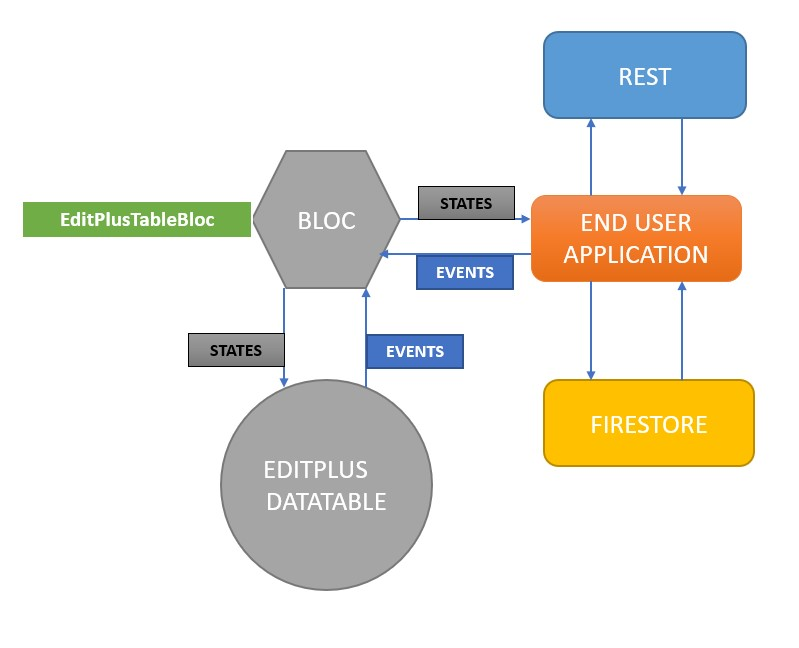

# The EDITPLUSDATATABLE
The EditPlusDataTable is a composite of a title (a text widget), a collection of editing buttons, a collection of input fields (only material TextFormField as at version 0.0.6) and a Material DataTable. 

## BACKGROUND
This is an extension of the  Material library based [Datatable](https://api.flutter.dev/flutter/material/DataTable-class.html) with editing convenience. It is coupled with a BLOC [EditPlusTableBloc] that handles data storage and communication with container widgets and applications. Through connection to a REST data source or another data source e.g. Google Firestore or the file system, data displayed on the table can be updated and at the same time new data entered into the table through its editing interface can be saved.

## SAMPLE EDITABLE TABLE
An editable table currently (as at version 0.0.6) includes the ability to add a new row and also to refresh the table from an external source. 


```dart
EditPlusDataTable(
  columnNames: tableColumnNames, 
  tableLabel : Text("SALES ITEMS"), 
  tableEditable : true, 
  refreshTableFunction: refreshTableFromREST)
```

## SAMPLE READ ONLY TABLE
A read only table currently (as at version 0.0.6) includes ONLY the ability to refresh the table from an external source. 


```dart
EditPlusDataTable(
  columnNames: tableColumnNames, 
  tableLabel : Text("SALES ITEMS"), 
  tableEditable : false, 
  refreshTableFunction: refreshTableFromREST)
```

## RELATIONSHIP WITH BLOC AND USER APPLICATION
A BLOC, EditPlusTableBloc is used for state management. The EditPlusDataTable takes advantage of the event in and state out capabilities of bloc to handle user interface creation and data persistence in concert with end user application.



## CONNECTING TO THE BLOC
To access the BLOC, it must be created within the scope of the calling widget. See below example where the bloc is created in a multi-bloc structure within the main application making it accessible to the whole application.

```dart
void main() {
  runApp(
    MultiProvider(providers: [
      BlocProvider<EditPlusTableBloc>(
        create: (_) => EditPlusTableBloc(),
      ),
    ],
    child : ExampleApp()
    )
  );
}
```

## READING DATA CONTENT AFTER ROW CREATION
When data is inserted i.e. a new row is created in the table. The table saves data to the accompanying BLOC. The bloc emits a state containing the data that has been saved.

The end user application should listen to the BLOC so as to receive the updated information in the case below, the information is then saved to REST destination.

## REFRESHING DATA - THE REFRESH FUNCTION
A refresh function is required with this version (0.0.6). Through the refresh application, the DataTable exposes its BLOC to the calling application which then can update it through a refresh event. As shown below, the BLOC refresh event is supplied with data from a REST source that is publicly available.

#### Our table constructor pointing to refresh function
```dart
EditPlusDataTable(
  columnNames: tableColumnNames, 
  tableLabel : Text("SALES ITEMS"), 
  tableEditable : false, 
  refreshTableFunction: refreshTableFromREST)
```
#### The refresh function. The bloc event expects a JSON collection of key value pairs where the keys are synonymous with the names of the table's columns.
```dart
  void refreshTableFromREST (EditPlusTableBloc tableBloc) async
  {
    // get data from a custom external REST source that requires an action and name of list
    // define REST parameters
    var action = 'GETPRICELIST';
    var listname = 'PRICELIST';

    final String restURL = myresturl; // replace this with your data sources

    final response = await http.get(restURL);
    
    // data returned by this URL is of the form of one or more JSON objects one of them being
    // listname : [collection of table rows]
    // get returned data as a list
    Map<String, dynamic> datalist = jsonDecode(response.body);

    // LIST OF JSON OBJECTS
    var jsonTableList = datalist[listname] as List;

    // load it into the table via the table's bloc data container.
    // print ("Refresh requested {$jsonTableList}");
    var editPlusTableEventMap = Map<String, dynamic>();
    editPlusTableEventMap['EVENTNAME'] = EditPlusBlocEvent.REFRESHTABLEEVENT;
    editPlusTableEventMap['EVENTDATA'] = jsonTableList;
    editPlusTableEventMap['COLUMNNAMES'] = tableColumnNames;
    tableBloc.add(editPlusTableEventMap);
  }
```

## CREATING THE TABLE - THE CONSTRUCTOR
The constructor is of the format below

```dart
  EditPlusDataTable(
    {@required Text tableLabel,                // table label
     @required List<String> columnNames,       // column names for the table, required by Material DataTable
     @required bool tableEditable,             // determine if this is a read only table or table with ability to add items
     @required Function refreshTableFunction,  // This function receives the BLOC in use by the table to end user application
     Map<String, dynamic> columnLabels         // this map contains a mapping of column names to column labels  
    }
  );
```